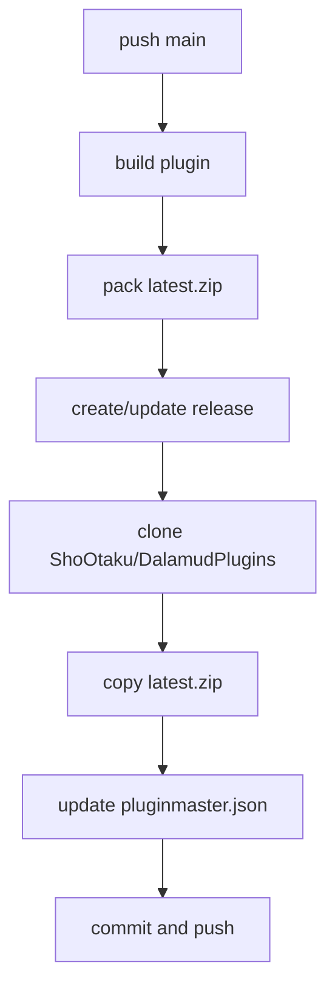

# 技术设计: 主分支自动发布并同步 DalamudPlugins

## 技术方案
### 核心技术
- GitHub Actions（`windows-latest`）
- .NET SDK 10（构建插件）
- PowerShell（打包与 JSON 变更）
- Git 命令行（跨仓库提交）

### 实现要点
- 触发条件：`on.push.branches = [main]`。
- 单工作流串行执行：构建 → 打包 → Release → 同步分发仓库。
- 版本号策略：`1.0.${{ github.run_number }}.${{ github.run_attempt }}`（可后续改为读取项目版本文件）。
- 分发包命名统一为 `latest.zip`，放置于目标仓库 `plugins/XSZRemoteChatBridge/latest.zip`。

## 架构设计

## 架构决策 ADR
### ADR-20260311-01: 使用单一工作流完成构建、发布、分发同步
**上下文:** 需求要求主分支推送后自动完成完整发布链路，且保持 pluginmaster 与发布产物一致。  
**决策:** 在当前仓库创建一个工作流，使用 `GITHUB_TOKEN` 发布 Release，使用 PAT 推送目标仓库。  
**理由:** 维护成本最低，链路可观测性集中，失败点单一。  
**替代方案:** 目标仓库侧再触发二次工作流 → 拒绝原因: 增加跨仓库事件耦合和排障复杂度。  
**影响:** 需要新增 1 个跨仓库 PAT Secret，并对失败回滚逻辑做幂等处理。

## API 设计
无新增业务 API；仅涉及 GitHub Actions 与 GitHub Release API 调用。

## 数据模型
`pluginmaster.json` 条目更新字段：
- `Author`, `Name`, `InternalName`
- `AssemblyVersion`
- `Description`, `ApplicableVersion`
- `RepoUrl`, `Tags`, `CategoryTags`, `DalamudApiLevel`
- `IconUrl`, `Punchline`
- `DownloadLinkInstall`, `DownloadLinkTesting`, `DownloadLinkUpdate`
- `LastUpdate`, `Changelog`

## 安全与性能
- **安全:**
  - PAT 使用 `DALAMUD_PLUGINS_PAT` Secret，不写入仓库文件。
  - workflow `permissions` 最小化：`contents: write` 仅用于 Release。
  - 推送目标仓库前校验仓库地址，避免误推。
- **性能:**
  - 使用 `actions/setup-dotnet` 缓存 NuGet。
  - 仅打包 Release 输出目录，减少上传体积。

## 测试与部署
- **测试:**
  - 本地执行 `dotnet build plugin/XSZRemoteChatBridge.csproj -c Release`。
  - workflow dry-run（`workflow_dispatch` 可选）验证打包与 JSON 更新脚本。
  - 校验 `pluginmaster.json` 为合法 JSON 且条目唯一。
- **部署:**
  - 合并到 `main` 后自动触发，无需手工部署。
  - 首次启用前在仓库配置 Secrets：
    - `DALAMUD_PLUGINS_PAT`
    - （可选）`DALAMUD_PLUGINS_BRANCH`，默认 `main`
