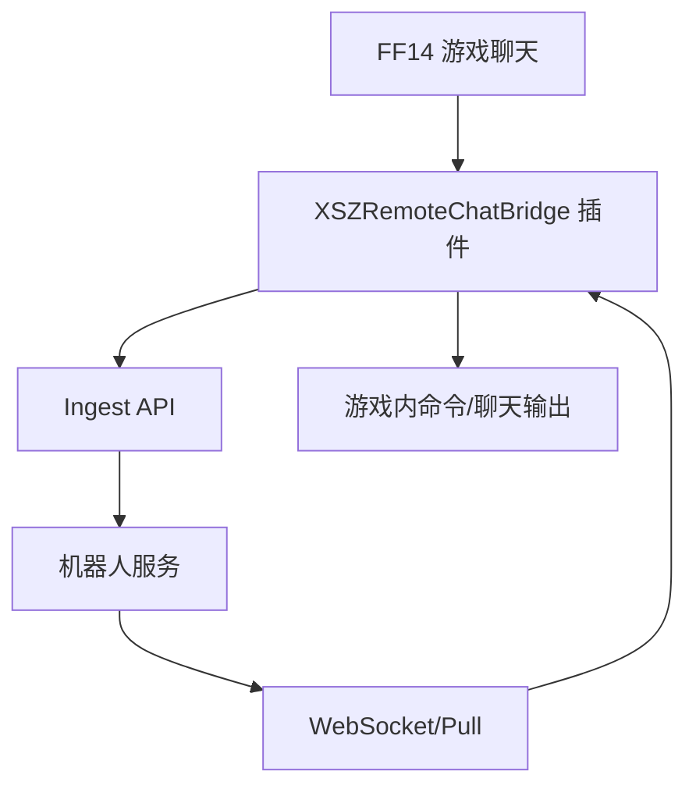
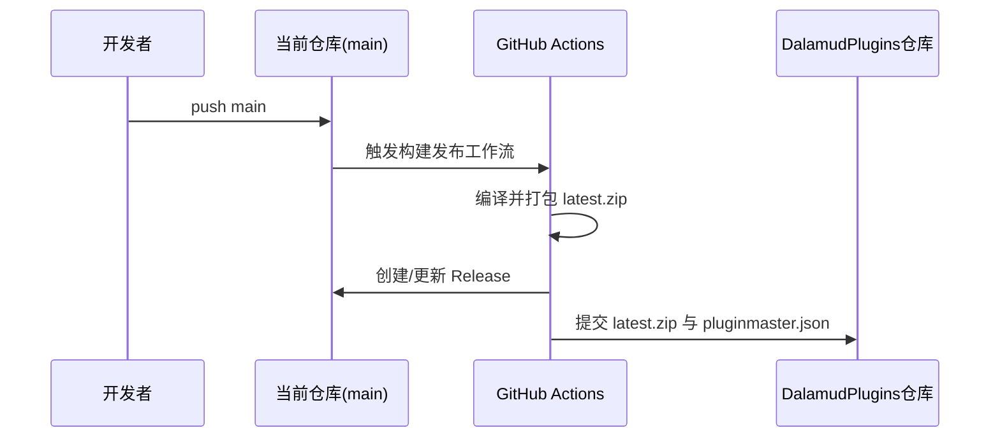

# 架构设计

## 总体架构

## 技术栈
- **后端/客户端逻辑:** C# / .NET 10
- **插件框架:** Dalamud API 14
- **通信:** HTTP + WebSocket（鉴权签名）
- **发布链路:** GitHub Actions + GitHub Release + DalamudPlugins 仓库

## 核心流程

## 重大架构决策
完整 ADR 存储在各变更的 `how.md` 中，本章节提供索引。

| adr_id | title | date | status | affected_modules | details |
|--------|-------|------|--------|------------------|---------|
| ADR-20260311-01 | 主分支自动发布并跨仓库同步插件分发 | 2026-03-11 | ✅已采纳 | CI, 发布链路 | [查看ADR](../history/2026-03/202603111630_main_push_release_sync/how.md#架构决策-adr) |
